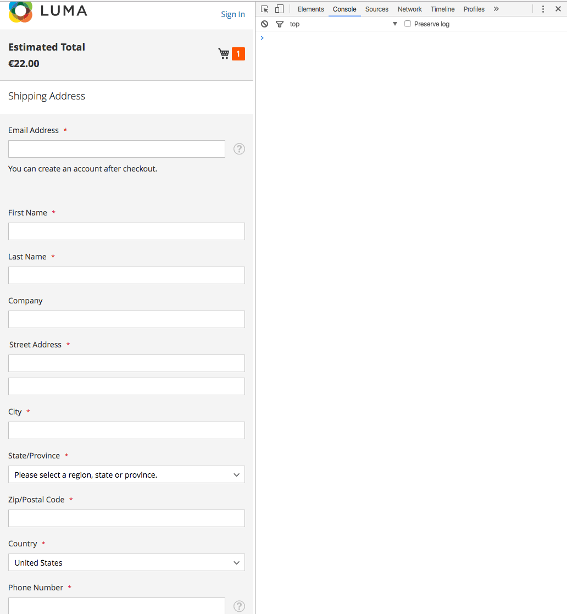
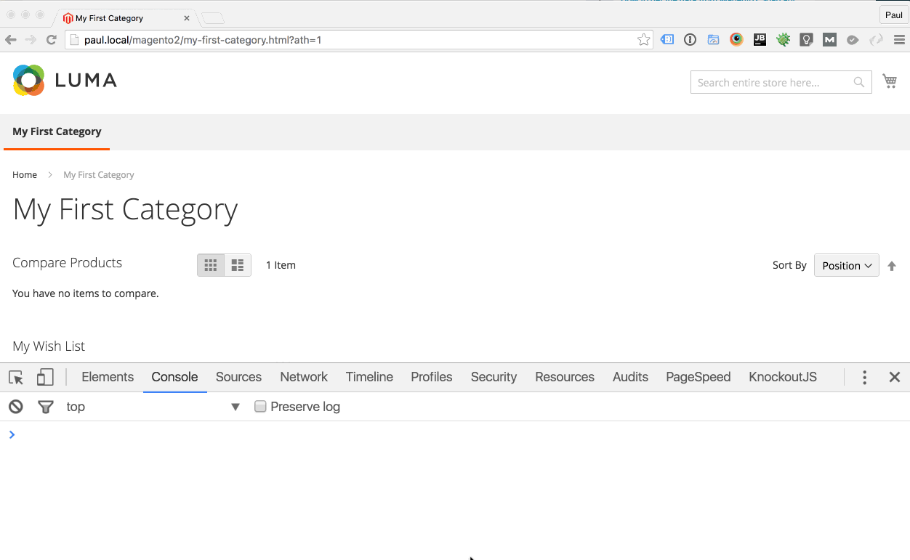
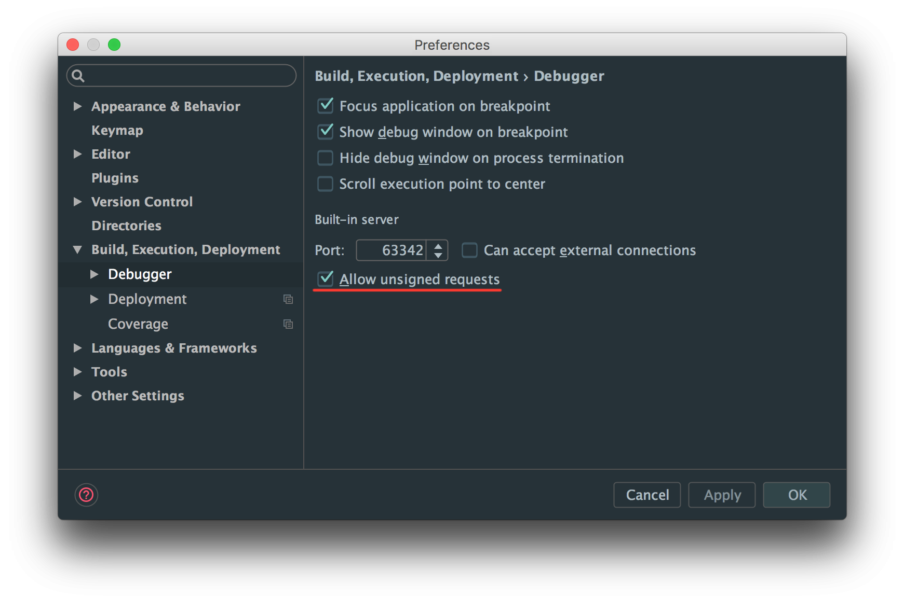
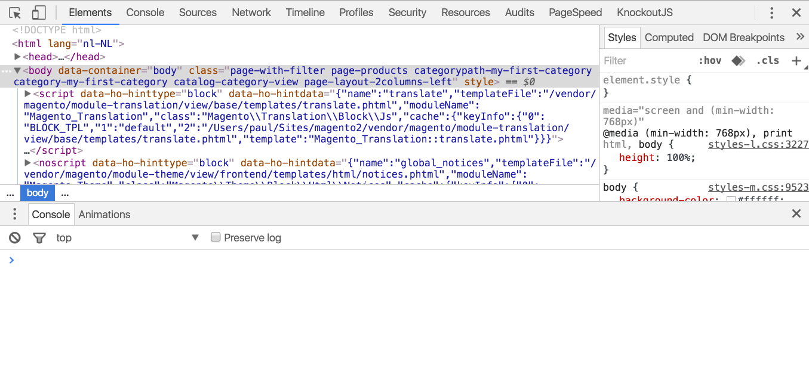

# H&O Magento 2 Advanced Template Hints module


### [View all Roadmaps](https://github.com/nholuongut/all-roadmaps) &nbsp;&middot;&nbsp; [Best Practices](https://github.com/nholuongut/all-roadmaps/blob/main/public/best-practices/) &nbsp;&middot;&nbsp; [Questions](https://www.linkedin.com/in/nholuong/)
<br/>




Ho_Templatehints extends the default Magento template hints.

- Easily accessible with with muscle memory `?ath=1`.
- Shows hints for **Templates**, **AbstractBlocks** (Blocks), **Containers** and **UI Components**.
- No layout interference: Using css outline instead of borders of other HTML elements, so it doesn't f'up the layout.



## Installation

```
composer require nholuongut/magento2-h-o-templatehints
php bin/magento module:enable Ho_Templatehints
php bin/magento setup:upgrade
```

### Development installation (git enabled)

```
composer require nholuongut/magento2-h-o-templatehints "dev-master"
php bin/magento module:enable Ho_Templatehints
php bin/magento setup:upgrade
```

### Configure PHPStorm, allow remote calls



## Usage
1. Set your Magento 2 installation to developer mode (when in production mode make sure to add your IP-address in Developer Client Restrictions).
2. Add `?ath=1` to your URL to activate.
3. Open up your console in you Chrome/Firefox/Safari/~IE~ devtools.
4. hold <kbd>⇧</kbd> (shift)
5. Hover over the element you wish to inspect
6. Voila! Hints everywhere!

### Hints for hidden elements
You can't show hints for a hidden element, for that purpose there is `hint($0)`:

```JS
//Select an element in the Elements panel in your devtools, it is now available with $0
hint($0)
```



# 🚀 I'm are always open to your feedback.  Please contact as bellow information:
### [Contact ]
* [Name: nho Luong]
* [Skype](luongutnho_skype)
* [Github](https://github.com/nholuongut/)
* [Linkedin](https://www.linkedin.com/in/nholuong/)
* [Email Address](luongutnho@hotmail.com)


[](https://ko-fi.com/nholuong)

# License
* Nho Luong (c). All Rights Reserved.🌟
